# 🚀 FinPilot – Personal Expense Tracker with Budget & AI Insights


A modern full-stack personal finance tracker that helps users manage their income, expenses, and budgets — with intelligent insights and visual dashboards.

---

## 🚀 Features

- 📊 **Dashboard Overview** – View weekly, monthly, and yearly expense trends.
- 💸 **Transaction Management** – Add, edit, and delete categorized income/expenses.
- 🎯 **Budgets & Goals** – Set budgets by category and monitor progress toward savings goals.
- 🧠 **AI Insights** – Personalized suggestions based on spending patterns.
- 🔔 **Budget Alerts** – Get notified when you exceed your budget limits.
- 🔐 **User Authentication** – Secure login/signup system with role-based access.
- 🌈 **Responsive UI** – Built using Tailwind CSS and React for a modern feel.

---

## 🛠️ Tech Stack

### 🔹 Frontend
- ⚛️ React.js (Vite)
- 💅 Tailwind CSS
- 🌐 React Router DOM
- 🧪 Zustand (State Management)
- 🔗 Axios

### 🔹 Backend
- 🟢 Node.js + Express.js
- 🐬 MongoDB with Mongoose
- 🔐 JWT Authentication
- 📊 MongoDB Aggregation Pipelines for analytics
- 🌍 Deployed on [Render](https://render.com)

---

## 📸 Screenshots

### 🌟LogIn 
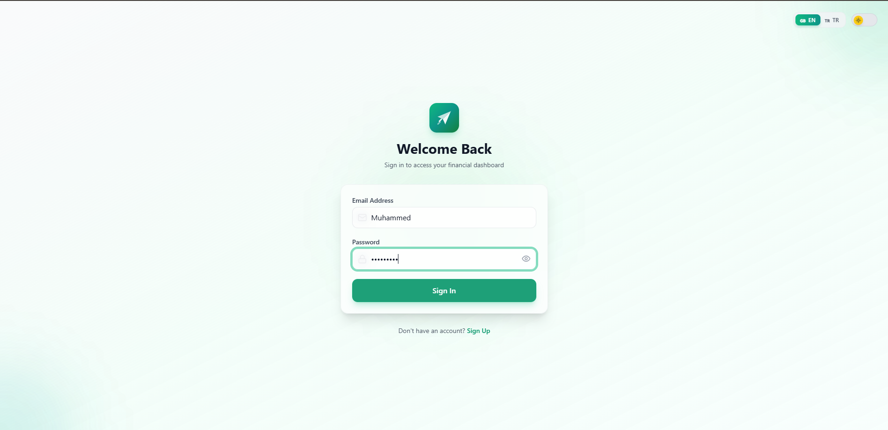

### 🌟SignUp 
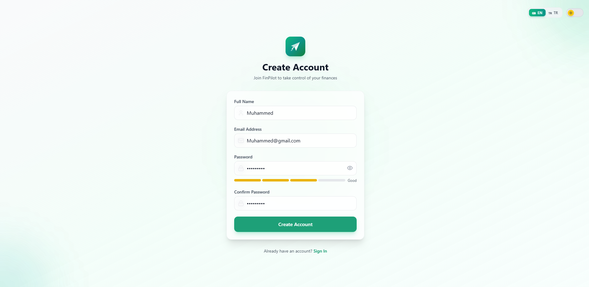

### 📊Dashboard 
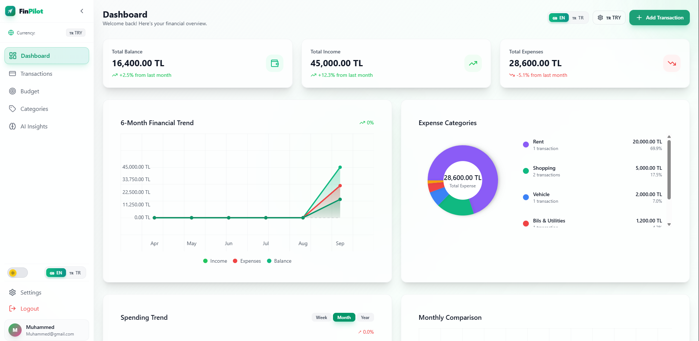

### ⚫Dark Mode 
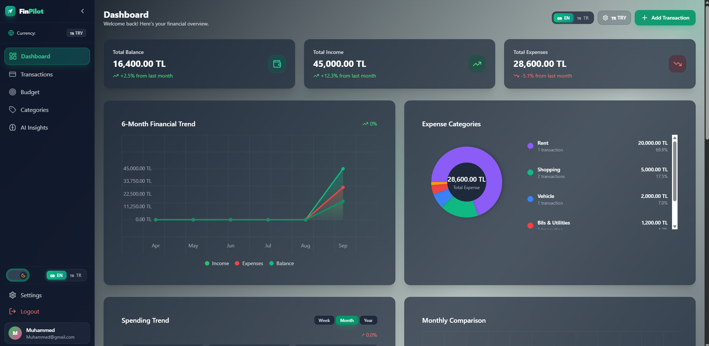

### 📊Dashboard 
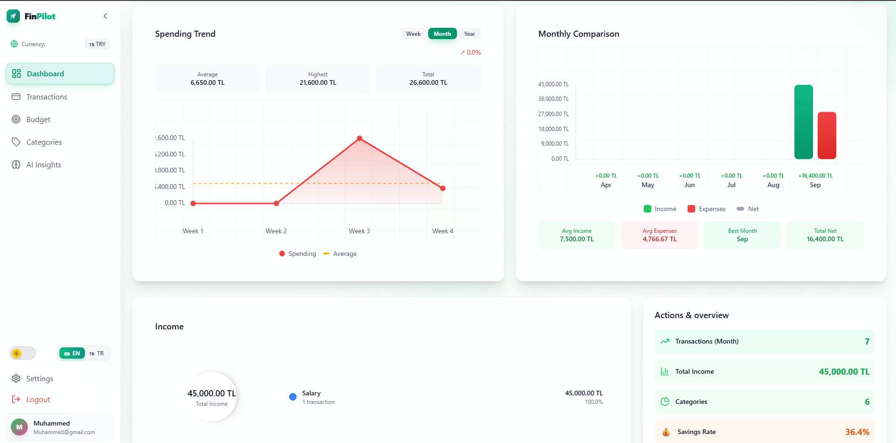

### 📊Dashboard 
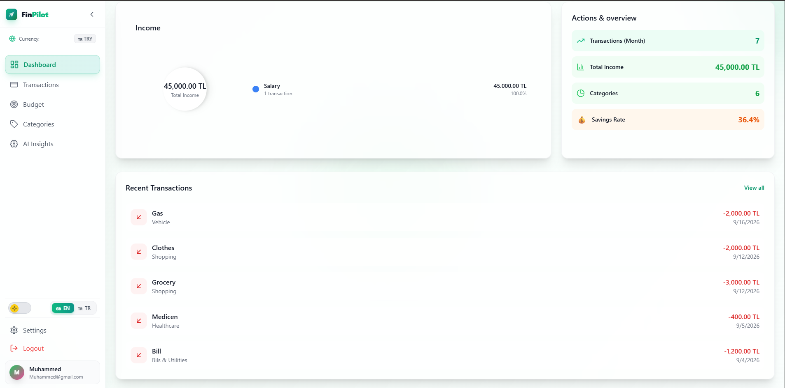

### 💵Various currencies
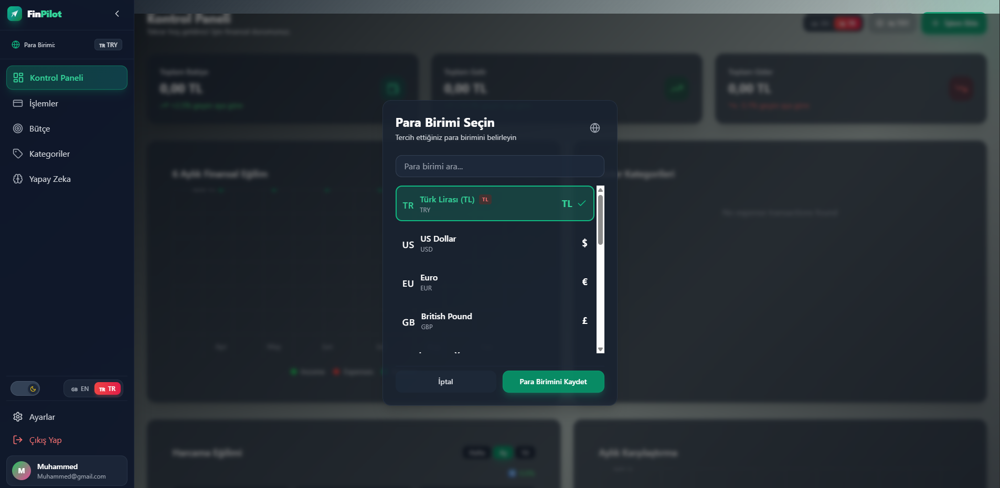

### 💸Transactions
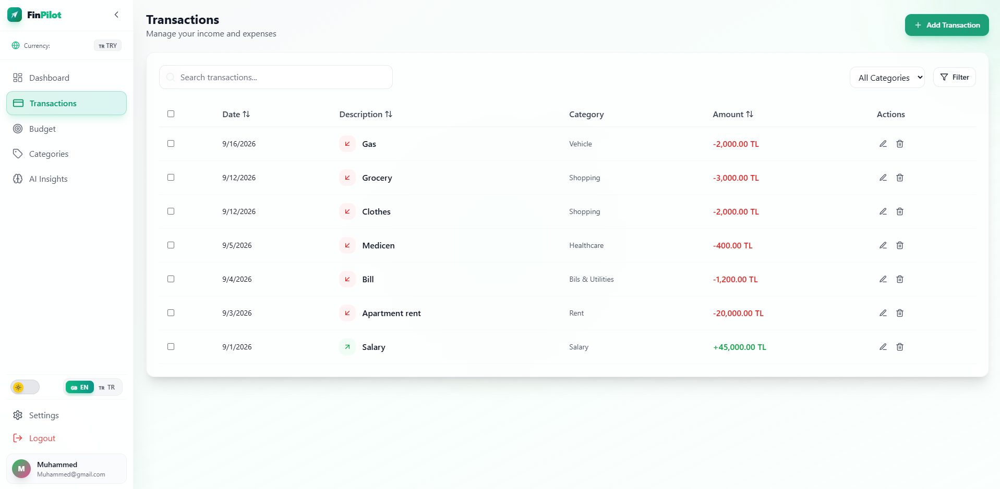

### 🗯️Budgets
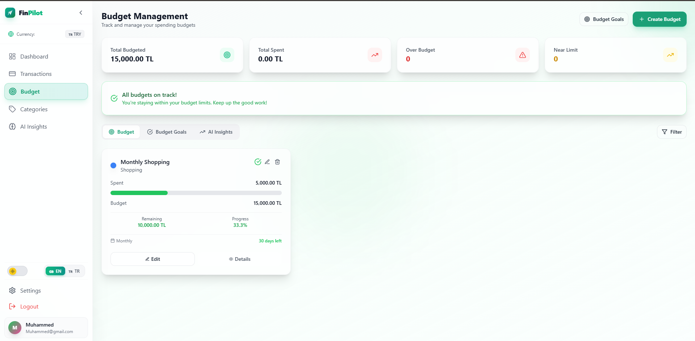

### 🔤Turkish language support
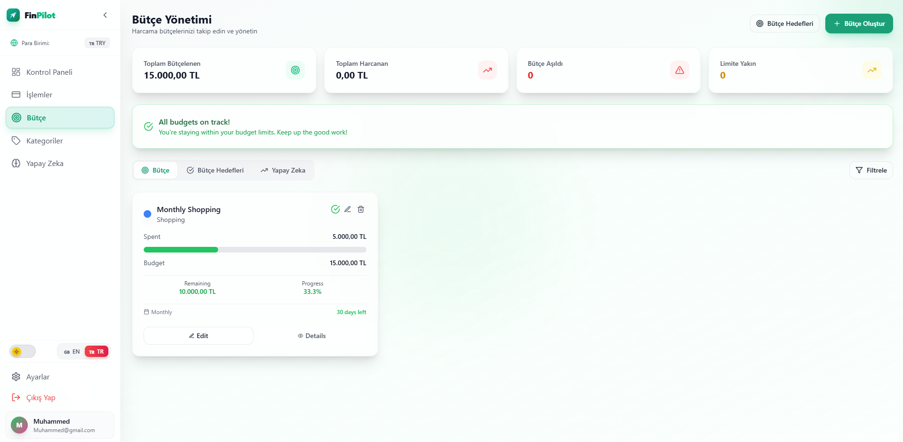

### 🧩Categories
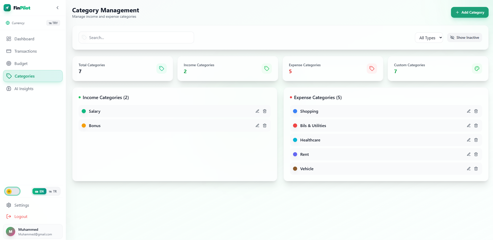

### 🧠AI insights
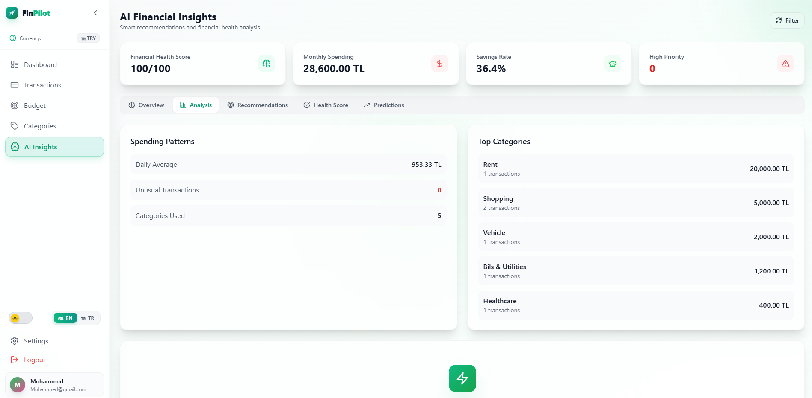

---

## 🧪 Getting StartedMore actions

### Prerequisites

- Node.js (v18+)
- MongoDB (local or cloud)
- npm or yarn

### 🔧 Installation

1. **Clone the Repository**
   ```bash
   git clone <repository-url>
   cd FinPilot
   ```

2. **Install Frontend Dependencies**
   ```bash
   cd client
   npm install
   ```

3. **Install Backend Dependencies**
   ```bash
   cd ../server
   npm install
   ```

4. **Setup Environment Variables**

   Create a `.env` file in `server/`:

   ```
   PORT=5000
   MONGODB_URI=your_mongo_db_uri
   JWT_SECRET=your_jwt_secret
   ```

5. **Run the App**

   - Run backend
     ```bash
     cd server
     npm run dev
     ```

   - Run frontend
     ```bash
     cd client
     npm run dev
     ```

   App will be live at: [http://localhost:5173](http://localhost:5173)

---

## 📁 Folder Structure

```
FinPilot/
├── frontend/         # React frontend
├── backend/          # Node/Express backend
├── README.md
```

---

## 🧑‍💻 Authors

**Muhammed Sheikh Hamza**  
[GitHub](https://github.com/Muhammed-SU) | [LinkedIn](www.linkedin.com/in/muhammed-sheikh-hamza-0109112a1)

**Ezzaldeen Bajoh**  
[GitHub](https://github.com/EZZALDEEN-BAJOH) | [LinkedIn](https://www.linkedin.com/in/ezzaldeen-bajoh-982015285/)

**Hasan Eleyvi**  

---

## 📄 License

This project is licensed under the MIT License.


